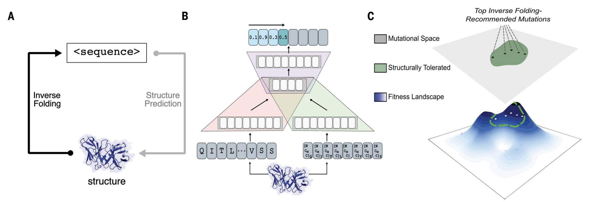

# structural-evolution

This repository scripts for running the analysis described in the paper ["Unsupervised evolution of protein and antibody complexes with a structure-informed language model"](https://www.science.org/stoken/author-tokens/ST-1968/full).

<p align="center">
  
</p>

## Setup/Installation
1. Clone this repository
```
git clone https://github.com/varun-shanker/structural-evolution.git
```
2. Install and Activate Conda Environment with Required Dependencies
```
conda env create -f environment.yml
conda activate struct-evo
```
3. Download and unzip the model weights from [here](https://zenodo.org/records/12631662), then insert them in torch checkpoints.
```
wget -P ~/.cache/torch/hub/checkpoints https://zenodo.org/records/12631662/files/esm_if1_20220410.zip
unzip ~/.cache/torch/hub/checkpoints/esm_if1_20220410.zip
```
4. Navigate to repository
```
cd structural-evolution
```

## Generating Predictions

To evaluate this model on a new protein or protein complex structure, run
```bash
python bin/recommend.py [pdb/cif file] --chain [X]
```
where `[pdb file]` is the file path to the pdb/cif structure file of the protein or protein complex and `[X]` is the target chain you wish to evolve. The default script will output the top `n`=10 predicted substitutions at unique residue positions (`maxrep=1`), where `n` and `maxrep` can be modified using the arguments (see below).

To recommend mutations to antibody variable domain sequences, we have simply run the above script separately on the heavy and light chains.

Additional arguments:

```
--seqpath: filepath where fasta with dms library should be saved (defaults to new subdirectory in outputs directory)
--outpath: output filepath for scores of variant sequences (defaults to new subdirectory in outputs directory)
--chain: chain id for the chain of interest
--n: number of top recommendations to be output (default: n=10)
--maxrep: maximum representation of a single site in the output recommendations (default: maxrep = 1 is a unique set of recommendations where each mutation of a given wildtype residue is recommended at most once)
--upperbound: only residue positions less than the user-defined upperbound are considered for recommendation in the final output (but all positions are still conditioned for scoring)
--order: for multichain conditioning, provides option to specify the order of chains
--offset: integer offset or adjustment for labeling of residue indices encoded in the structure file
--multichain-backbone: use the backbones of all chains in the input for conditioning (default is True)
--singlechain-backbone: use the backbone of only the target chain in the input for conditioning
--nogpu: Do not use GPU even if available
```

 For example, to generate mutations for the heavy chain of LYCoV-1404, we would simply run the following: 

```
python bin/recommend.py examples/7mmo_abc_fvar.pdb \
    --chain A --seqpath examples/7mmo_chainA_lib.fasta \
    --outpath examples/7mmo_chainA_scores.csv \
    --upperbound 109 --offset 1
```
In this example, we use a pdb structure file with variable regions of both chains of the antibody in complex with the antigen, SARS-CoV-2 receptor binding domain (RBD). To obtain recommendations specifically for the heavy chain, we specify chain A. The fasta file containing the library screened *in silico* and the corresponding output scores file are saved at the indicated paths.
To limit the recommendations that are output and exclude mutations predicted in the final framework region, we set the upper bound to 109 (this value will vary for each antibody). Since the first residue is not included in the structure, we specify an offset of 1 to ensure the returned mutations are correctly indexed.

## Paper analysis scripts

To reproduce the analysis in the paper, first download and extract data with the commands:
```bash
wget https://zenodo.org/record/11260318/files/data.tar.gz
tar xvf data.tar.gz
```
To evaluate alternate sequence-only and structure-based scoring methods, follow directions [here](https://github.com/facebookresearch/esm?tab=readme-ov-file#zs_variant) and [here](https://github.com/dauparas/ProteinMPNN) for installation instructions.

## Citation

Please cite the following publication when referencing this work.

```
@article {Shanker-struct-evo,
	author = {Shanker, Varun and Bruun, Theodora and Hie, Brian and Kim, Peter},
	title = {Unsupervised evolution of protein and antibody complexes with a structure-informed language model},
	year = {2024},
	doi = {10.1126/science.adk8946},
	publisher = {American Association for the Advancement of Science},
	URL = {https://www.science.org/doi/10.1126/science.adk8946},
	journal = {Science}
}
```

## License
This project is licensed under the MIT License - see the LICENSE file for details.
